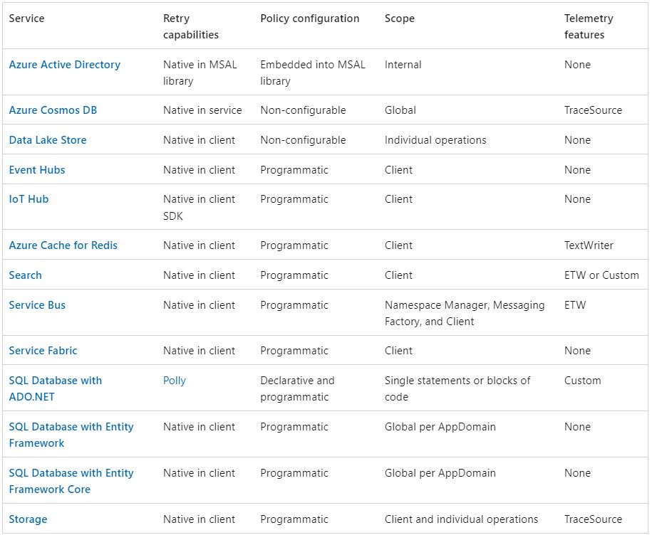

# Retry Guidance

# Transient fault handling with [Polly](https://github.com/App-vNext/Polly)
Polly is a library to programmatically handle retries and circuit breaker strategies. The Polly project is a member of the .NET Foundation. For services where the client doesn't natively support retries, Polly is a valid alternative and avoids the need to write custom retry code, which can be hard to implement correctly. Polly also provides a way to trace errors when they occur, so that you can log retries.

| Service  | Notes |
| ------------- | ------------- |
| [Azure SQL](azure-sql-retry.md)  | Sql Data Client   |
| Service Bus  | SDK Client  |
| Entity Framework 6  | EF6 Libraries  |
| Entity Framework Core | EF6 Libraries  |
